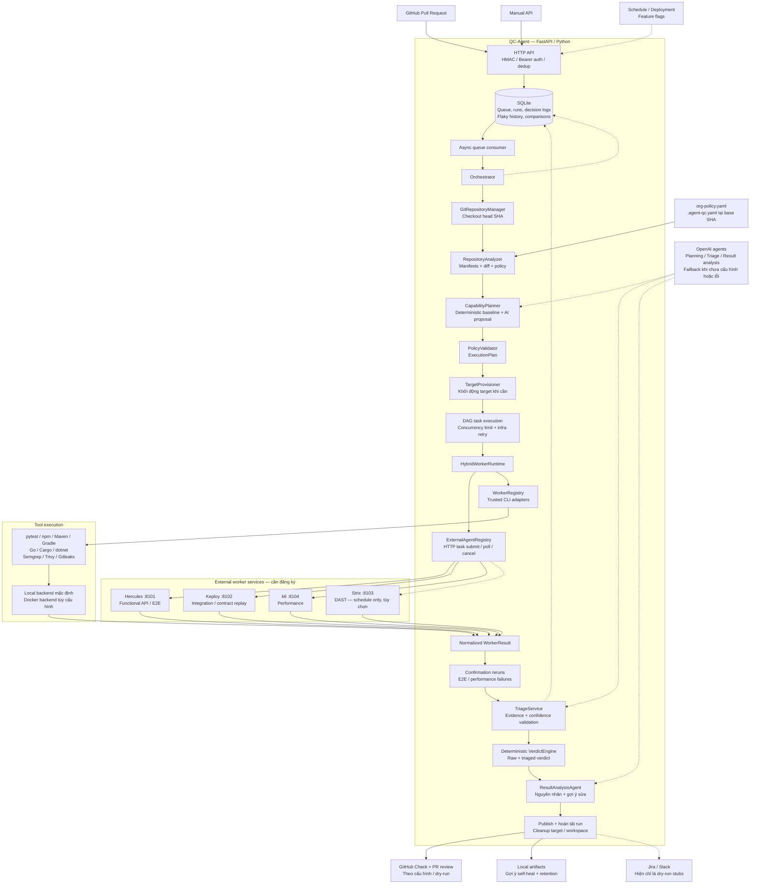

# Kiến trúc QC-Agent hiện tại

Sơ đồ đối chiếu với source code ngày 07/10/2026. Đây là kiến trúc đã triển khai trong code, không phải xác nhận các dịch vụ đang chạy.

## Cách đọc

- Orchestrator là trung tâm điều phối; model đề xuất kế hoạch và phân tích, còn PolicyValidator và VerdictEngine quyết định theo rule.
- Task dùng capability/target để chọn worker. `auto` ưu tiên external agent, rồi fallback sang tool khi được phép; `external_agent` yêu cầu worker ngoài; `tool` đi thẳng CLI adapter.
- Một queue consumer xử lý run lần lượt; các task sẵn sàng trong DAG chạy song song với semaphore, mặc định 4 slot. Retry tối đa 2 lần cho lỗi hạ tầng có thể retry.
- Sau worker execution, hệ thống chạy confirmation cho finding lỗi E2E/performance, triage rồi tổng hợp verdict. Chế độ `observe` dùng raw verdict; chế độ khác dùng triaged verdict.
- Config repository lấy tại base SHA; code kiểm thử lấy tại head SHA.

## Trạng thái và giới hạn

- Script local stack khởi động orchestrator :8000, Hercules :8101, Keploy :8102, k6 :8104; Cloudflare tunnel là tùy chọn. Script không khởi động Strix.
- Trong checkout đang đọc chỉ có `external-agents.example.yaml` và `external-agents.local.example.yaml`, chưa có `external-agents.yaml`. Registry mặc định sẽ rỗng nếu không có file đăng ký hoặc đường dẫn override.
- Local host là execution backend mặc định. Docker backend đã có code nhưng cần cấu hình image; sơ đồ không khẳng định Docker đang hoạt động.
- Schedule/deployment là endpoint sau feature flag, không có scheduler tự chạy trong sơ đồ này.
- Jira/Slack hiện trả dry-run receipt; chưa gửi ra dịch vụ thật. Self-heal chỉ lưu gợi ý, không tự push code hoặc mở PR.

## Source chính

- `app/api/http.py`: composition root, endpoints và queue consumer.
- `app/application/orchestrator.py`: pipeline và task execution.
- `app/application/analysis.py`, `planning.py`, `triage.py`: phân tích, lập kế hoạch, triage.
- `app/domain/verdict.py`: tổng hợp verdict.
- `app/infrastructure/execution/hybrid.py`, `registry.py`: routing và CLI registry.
- `app/infrastructure/external_agents/`: registry và HTTP runtime.
- `workers/`: các worker HTTP độc lập.
- `scripts/start_local_stack.ps1`: topology local Windows.
